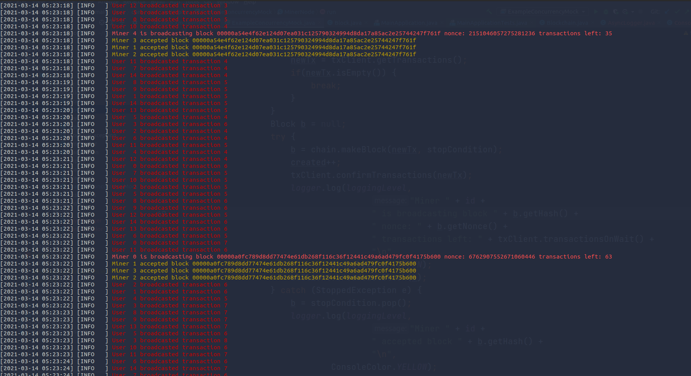
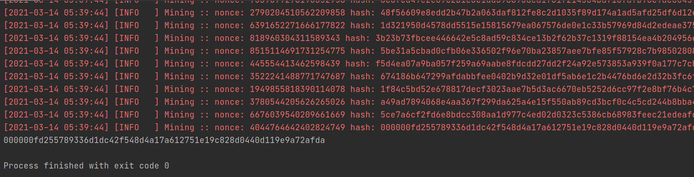

# Blockchain protocol implementation

A distributed blockchain based transaction system from scratch. Work in progress.

p2p hard...here's a mock network implementation with a centralized approach. Ran on a single machine across multiple threads.

#### Requirements:

  * Maven
  
  * Java JDK 15

#### Run:

* `mvn clean install`

* `mvn exec:java`

#### Screenshots:

